Parameters to Check:

 - **Commit Duration:** Time taken for React to render the committed updates.
 - **Render Duration:** Time taken for individual components to render.
 - **Interactions:** User interactions that triggered the renders.
 - **Flame Graph:** Visual representation of component render times.
 - **Ranked Chart:** Sorted list of components by render duration.

## BEFORE OPTIMISATION

| Interaction | Max Commit Duration | Max Render Duration | Caused by | Flame Graph | Ranked Chart |
|---                     |---:     |---:     |---|---|---|
| Sorting a column       | 239.1ms | 236.7ms | SearchBar, Table     | 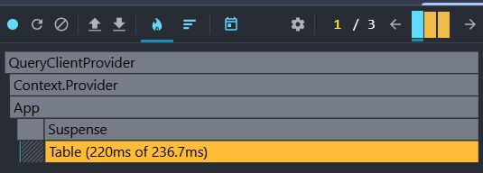 | 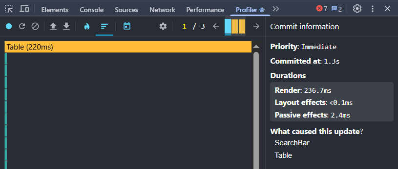  |
| Search by country name | 251.6ms | 244.7ms | SearchBar, Table     | 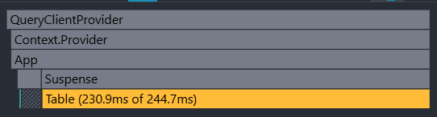 | 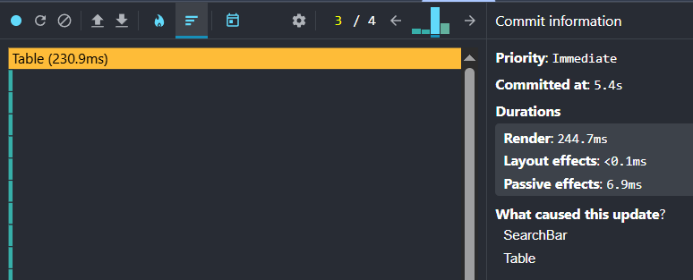 |
| Search by year         | 232.9ms | 230.8   | SearchBar, Table     | 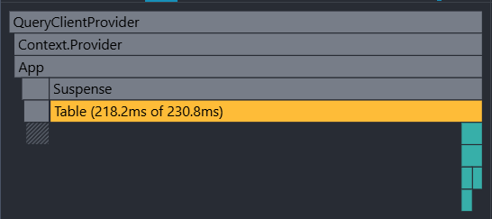 | 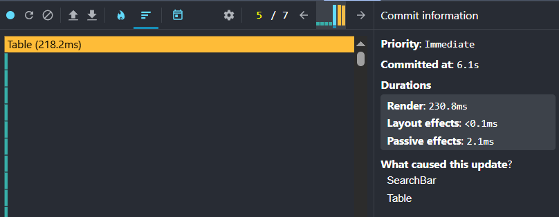 |
| Add column             | 316.2ms | 316ms   | ColumnsSelect, Table | 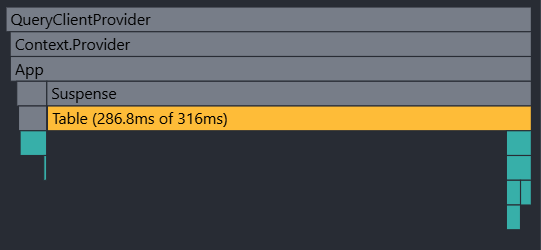 | 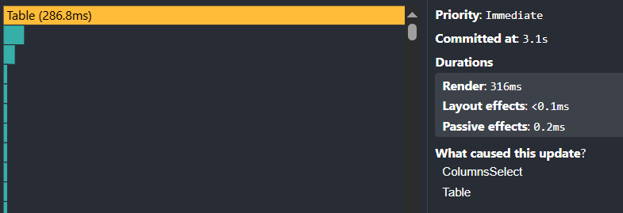 |
| Remove column          | 279.9ms | 279.8ms | ColumnsSelect, Table | 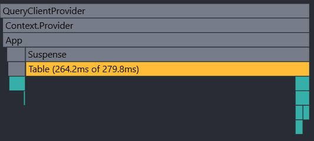 | 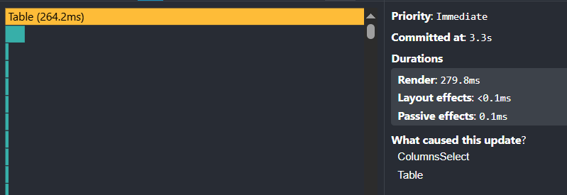 |

## AFTER OPTIMISATION

| Interaction | Max Commit Duration | Max Render Duration | Caused by | Flame Graph | Ranked Chart |
|---                     |---:     |---:     |---|---|---|
| Sorting a column       | 215.9ms | 215.3ms | SearchBar, Table     | 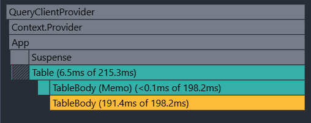 | 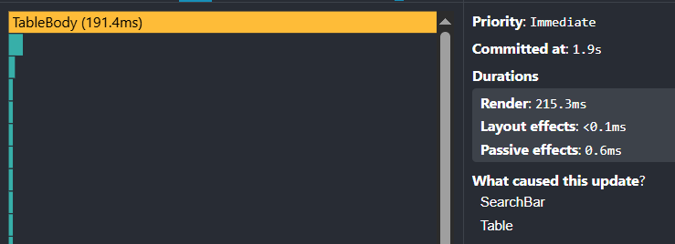  |
| Search by country name | 40.7ms | 40.2ms | SearchBar, Table     | 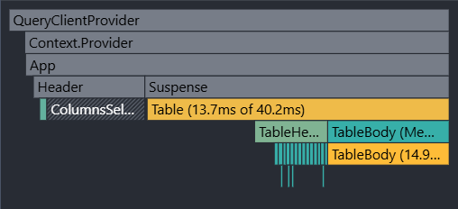 | 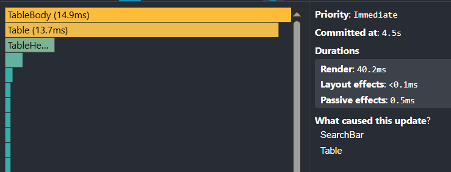 |
| Search by year         | 233.7ms | 233.2ms | SearchBar, Table     | 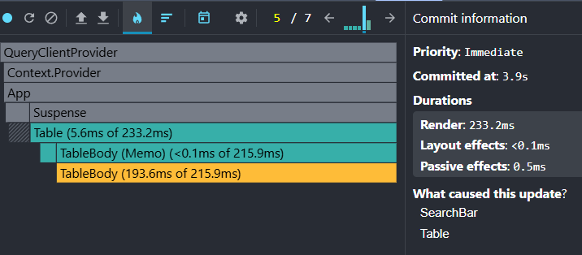 | 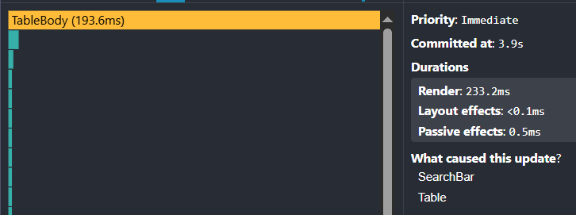 |
| Add column             | 270.6ms | 246.9ms | ColumnsSelect, Table | 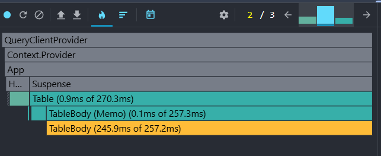 | 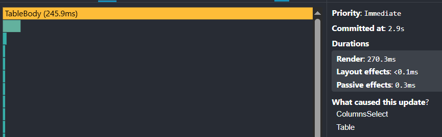 |
| Remove column          | 239ms   | 217.1ms | ColumnsSelect, Table | 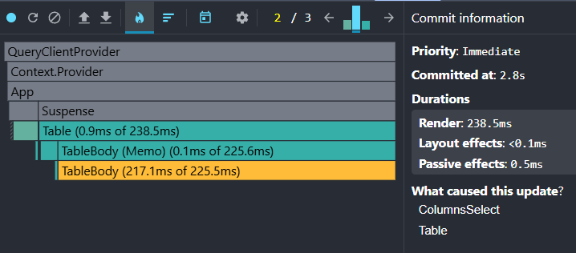 | 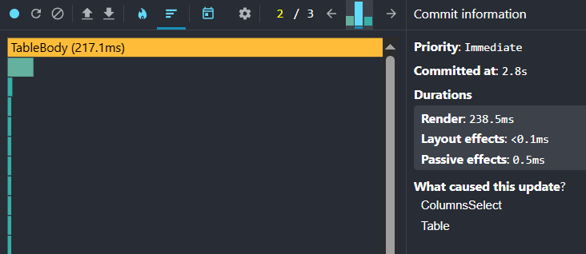 |

Commit and render times decreased:
- sorting a column (-10%),
- adding/deleting columns (-14–22%),
- searching by country (~−84%). 

Time has increased a bit on search by year (+0.3–1%).
